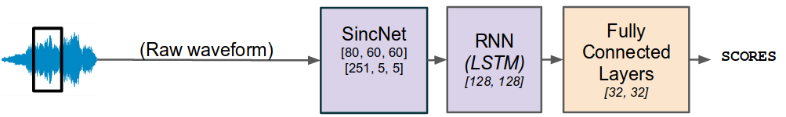

# A Voice Type Classifier For Child-Centered Daylong Recordings

This is the git repository associated to our Interspeech 2020 publication : [*An open-source voice type classifier for child-centered daylong recordings*](https://arxiv.org/abs/2005.12656)



In this repository, you'll find all the necessary code for applying a pre-trained model that, given an audio recording, classifies each frame into **[SPEECH, KCHI, CHI, MAL, FEM]**.
- FEM stands for female speech
- MAL stands for male speech
- KCHI stands for key-child speech
- CHI stands for other child speech
- SPEECH stands for speech :)

Our model's architecture is based on SincNet [[3]](https://github.com/mravanelli/SincNet/) and LSTM layers.
Details can be found in our paper [[1]](https://arxiv.org/abs/2005.12656).
The code mainly relies on pyannote-audio [[2]](https://github.com/pyannote/pyannote-audio), an awesome python toolkit for building neural building blocks that can be combined to solve the speaker diarization task.

### How to use ?

0) [Disclaimer /!\\](./docs/disclaimer.md)
1) [Installation](./docs/installation.md)
2) [Applying](./docs/applying.md)
3) [Evaluation](./docs/evaluations.md)
4) [Going further](./docs/going_further.md)

### Awesome tools using our voice type classifier

***ALICE***, an Automatic Linguistic Unit Count Estimator, allowing you to count the number of words, syllables and phonemes in adult speakers' utterances : 

- [Paper link](https://psyarxiv.com/p95dz/)
- [Git repo](https://github.com/orasanen/ALICE)

### References

The main paper :

[1] An open-source voice type classifier for child-centered daylong recordings

```text
@inproceedings{lavechin2020opensource,
title={An open-source voice type classifier for child-centered daylong recordings},
author={Marvin Lavechin and Ruben Bousbib and Hervé Bredin and Emmanuel Dupoux and Alejandrina Cristia},
year={2020},
booktitle = {Interspeech 2020}
}
```

We also encourage you to cite this work :

[2] pyannote.audio: neural building blocks for speaker diarization

```text
@inproceedings{Bredin2020,
  Title = {{pyannote.audio: neural building blocks for speaker diarization}},
  Author = {{Bredin}, Herv{\'e} and {Yin}, Ruiqing and {Coria}, Juan Manuel and {Gelly}, Gregory and {Korshunov}, Pavel and {Lavechin}, Marvin and {Fustes}, Diego and {Titeux}, Hadrien and {Bouaziz}, Wassim and {Gill}, Marie-Philippe},
  Booktitle = {ICASSP 2020, IEEE International Conference on Acoustics, Speech, and Signal Processing},
  Address = {Barcelona, Spain},
  Month = {May},
  Year = {2020},
}
```

[3] Speaker Recognition from Raw Waveform with SincNet

```text
@misc{ravanelli2018speaker,
    title={Speaker Recognition from Raw Waveform with SincNet},
    author={Mirco Ravanelli and Yoshua Bengio},
    year={2018},
    eprint={1808.00158},
    archivePrefix={arXiv},
    primaryClass={eess.AS}
}
```
