# Evaluations

## Running times

The running times have been computed on Nvidia® Tesla V100 GPUs with 32 GB of memory and  Intel® Xeon® Gold 6230 CPUs.
The following table shows real time factors you can expect from the model.

| batch_size | GPU | CPU |
| :-----:|:-----:|:-----:|
| 32 | 1/35 | 0.27 |
| 64 | 1/45 |0.26 |
| 128 | OOM* | 0.25 |
| 256 | OOM | 0.24 |

***Tab 0. Running times as a function of the batch size and the device.***

It takes roughly 1/35 of the audio duration to run the model with a batch of size 32 on GPU.
Similarly, it takes approximatively 1/4 of the audio duration to run the model on CPU.

*OOM stands for out of memory.

## Within-domain performances

Here are the results computed on the development set and the test set of BabyTrain (whose Paido domain has been removed).
All the results are given in terms of ***fscore*** between ***precision*** and ***recall*** such as computed in [pyannote-metrics](https://github.com/pyannote/pyannote-metrics).

| Class | Precision | Recall | Fscore |
| -----:|:-----:|:-----:|:-----:|
| KCHI | 0.82 | 0.80 | 80.65 |
| CHI | 0.22 | 0.50 | 30.63 |
| FEM | 0.84 | 0.84 | 84.21 |
| MAL | 0.43 | 0.44 | 43.73 |
| SPEECH | 0.89 | 0.91 | 90.33 |
| AVE | 0.71 | 0.69 | 65.91 | 

***Tab 1. Performances of our model on the development set.***

| Class | Precision | Recall | Fscore |
| -----:|:-----:|:-----:|:-----:|
| KCHI | 0.82 | 0.73 | 77.37 | 
| CHI | 0.19 | 0.40 | 25.65 | 
| FEM | 0.78 | 0.87 | 82.40 | 
| MAL | 0.38 | 0.48 | 42.25 | 
| SPEECH | 0.86 | 0.92 | 88.45 |
| AVE |0.60 | 0.68 | 63.22 |

***Tab 2. Performances of our model on the test set.***

The tresholds that decide whether each class is activated or not have been computed on the development set.
If you have some annotations, you can fine-tune these tresholds on your own dataset. 

Depending on your application, you might also want to optimize more the precision than the recall (or vice-versa).
With pyannote-audio, you can optimize these tresholds on the recall while fixing the precision.

By doing so, you can end up with a model having a high precision/low recall or low precision/high recall, which might be useful for some applications.
For instance, we might have some data that we'd like to annotate, but we'd like to focus the annotation campaign on the key-child to study how much the latter is vocalizing.
In that case, it'd be useful to run a model that has a high precision but low recall on the dataset. That way, we can extract moments when we are almost sure that the key-child (accepting that we miss some of these moments) is vocalizing and we can provide these moments to the human annotators.

For illustrative purposes, here's the precision/recall (computed on the development set) curves for each of the class : 

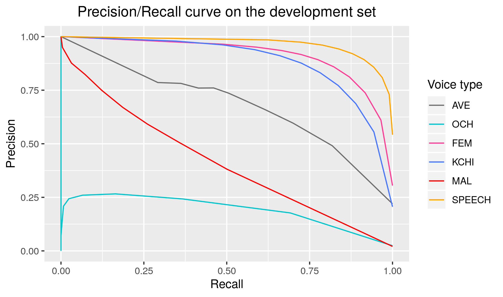

## Performances on the held-out set 

We compute the performances on the held-out set, that means a set that has never been seen during the training (neither by our model nor by LENA's one).

Here, we'd like to compare 2 models that have a slightly different design. The main differences between the LENA model and ours are :
1) Our model returns a **SPEECH** class whereas LENA does not.
2) LENA returns an **OVL** class (without specifying which classes are overlapping) whereas our model does not have an **OVL** class, but multiple classes can be activated at the same time.
3) LENA returns a class for electronical noises (**ELE**) whereas our model does not (our training set hasn't been annotated for this class).

Comparing these 2 approaches requires us to make some choices : 

1) The LENA original model returns the following classes : **CHF**,**CHN**,**CXN**,**CXF**,**FAN**,**FAN**,**MAN**,**MAF**,etc.
The **N** stands for "near" whereas the **F** stands for "far". We need to map this set of input labels in a new set
containing only the labels **KCHI**, **CHI**, **MAL**, **FEM**, and **SPEECH**. 
A choice could be to map **CHF**, and **CHN** to **KCHI**, or we could map **CHN** to **KCHI** and **CHF** to **SIL** for instance.
Here, we chose the mapping that leads to best performances for LENA. That consists of keeping only the **N** classes, and mapping the **F** classes to **SIL**.

2) What to do with the **OVL** class ? 
This class is not explicitly present in our set of human-annotated labels. 
However, and since a given frame might have been annotated as belonging to 2 classes by humans, we can choose to map the frames with more than 2 speakers to the **OVL** class.
By doing so, we would loose the information of which types of voices are overlapping.
Another option might consist of not creating the **OVL** class, keeping human-made labels untouched. 
In which case a model would have to predict multiple classes at the same time, the same way human did.

3) What to do with the **ELE** class ?
For knowing what are LENA performances on this class, you can refer to [1].
One choice could be to completely discard this class as our model doesn't predict electronical noises.
Or, and since our held-out set has been annotated for this class, we coud have a look at the distribution of predictions
for electronical noises to answer the following question : are electronical noises classified as speech ?

In ***Tab 3.*** and ***Tab 4.***, we chose the optimal mapping for LENA. 
We also decided to keep human-made labels untouched. That means that we do not consider any **OVL** class, but overlapping moments are considered in the evaluation.
If a given frame has been annotated as belonging to both **KCHI** and **FEM**, the model is also gonna be expected to return these 2 classes.
We are aware that this choice potentially advantages our model over LENA. 
But we think that by doing so, we penalize LENA's design that is less informative than our model in case of overlapping speech.
However, in all fairness, we explore alternative choices in the section showing the confusion matrices. 

| Class | Precision | Recall | Fscore |
| -----:|:-----:|:-----:|:-----:|
| KCHI | 0.62 | 0.77 | 68.78 |
| CHI |0.47 | 0.26 | 33.24 |
| FEM | 0.70 | 0.58 | 63.48 |
| MAL | 0.40 | 0.47 | 42.91 |
| SPEECH | 0.77 | 0.80 | 78.43 |
| AVE |0.59 | 0.57 | 57.37 |

***Tab 3. Performances of our model on the held-out set.***

| Class | Precision | Recall | Fscore |
| -----:|:-----:|:-----:|:-----:|
| KCHI | 60.91 | 50.07 | 54.96 |
| CHI |27.34 | 29.97 | 28.59 |
| FEM | 63.87 | 31.96 | 42.60 |
| MAL | 43.57 | 32.5 | 37.23 |
| SPEECH | 65.04 | 76.35 | 70.24 |
| AVE | 52.15 | 44.17 | 46.73 |

***Tab 4. Performances of the LENA model on the held-out set.***

## Confusion matrices

To better understand which kind of errors, our model and LENA's model are doing, we can have a look
at the confusion matrices.

### Confusion matrices for LENA

There are multiple ways to draw confusion matrices looking at either the SPEECH vs NON-SPEECH frames, or looking at the confusion matrix showing the voice types.

#### Speech / Non Speech

As LENA does not return a SPEECH class, we aggregated the voice types [KCHI, OCH, MAL, FEM] into one single SPEECH class.

Choices : 
- **SPEECH** built from the union of [**KCHI**, **OCH**, **MAL**, **FEM**] for both LENA and gold labels

Precision of LENA            |  Recall of LENA
:-------------------------:|:-------------------------:
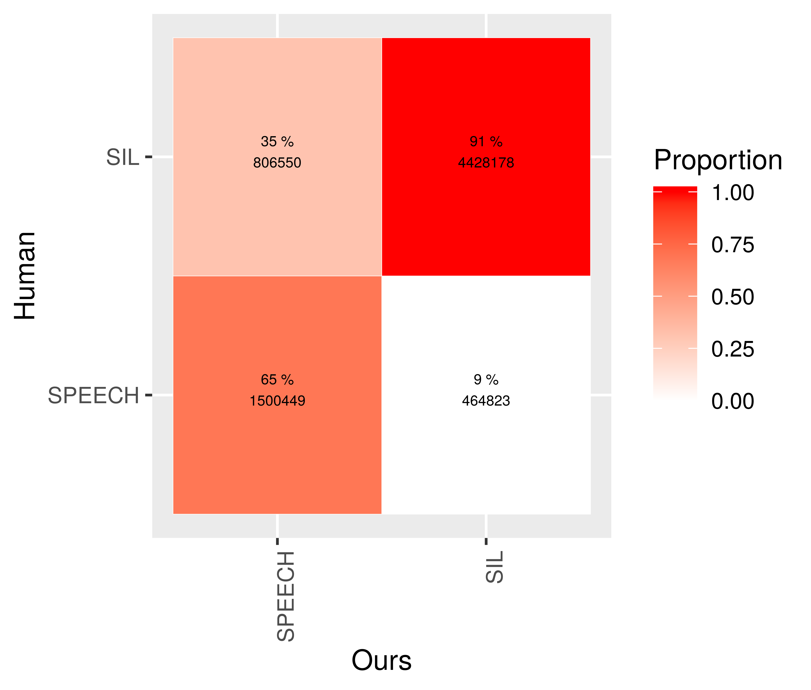 | 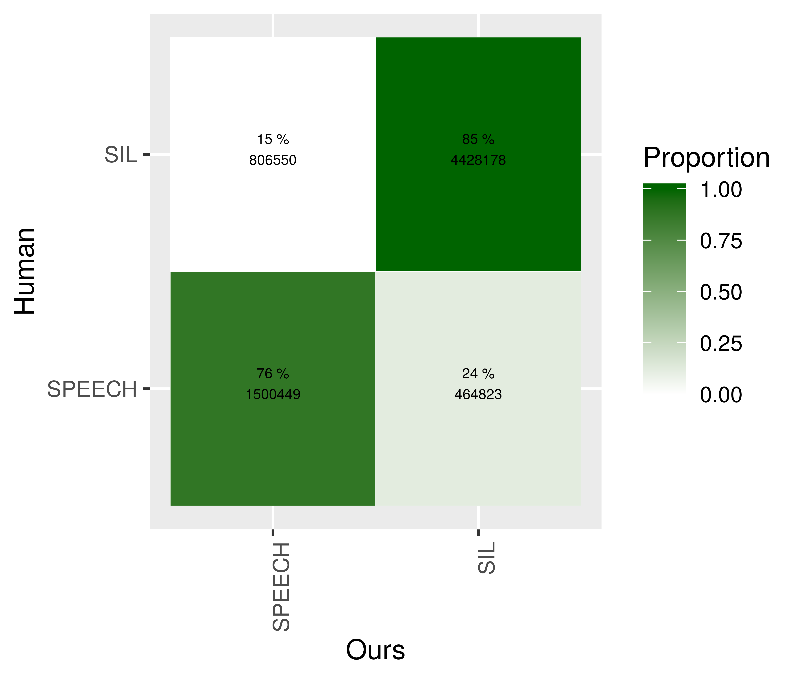

#### Voice types with OVL class

Choices : 
- **OVL** built from the intersection of [**KCHI**, **OCH**, **MAL**, **FEM**] for gold labels.
- **OVL** considered "as-is" for LENA labels.
- **ELE** considered "as-is" for LENA and gold labels.

Precision of LENA            |  Recall of LENA
:-------------------------:|:-------------------------:
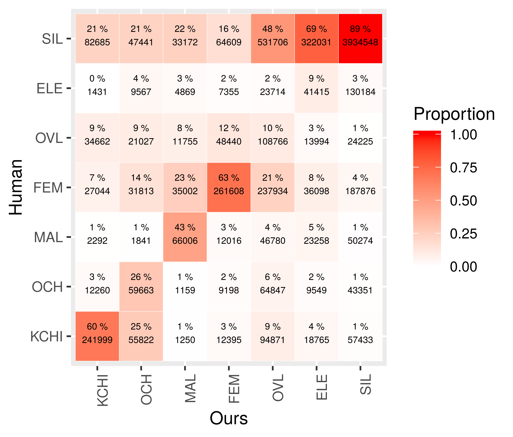 | 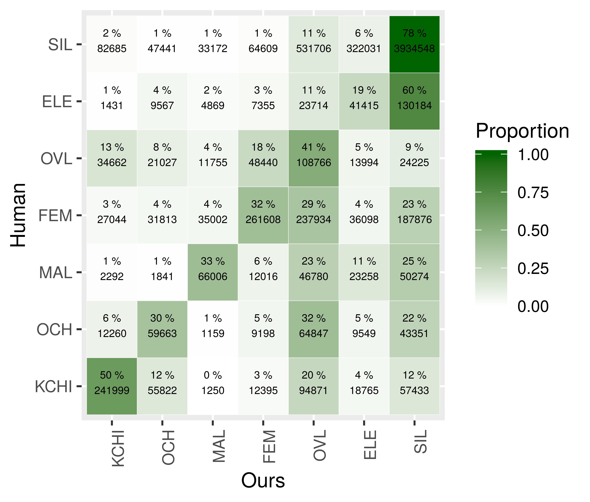

#### Voice types without OVL class

Choices : 
- **OVL** class discarded for LENA (mapped to SIL).
- **ELE** class discarded for LENA and gold (mapped to SIL).
- Frames belonging to multiple classes according to the human annotators count for all the classes they've been classified as
 (if a frame has been annotated as belonging to both **KCHI** and **FEM**, this frame counts as 1 success and 1 failure, 2 successes, or 2 failures depending on the model's prediction).

Precision of LENA            |  Recall of LENA
:-------------------------:|:-------------------------:
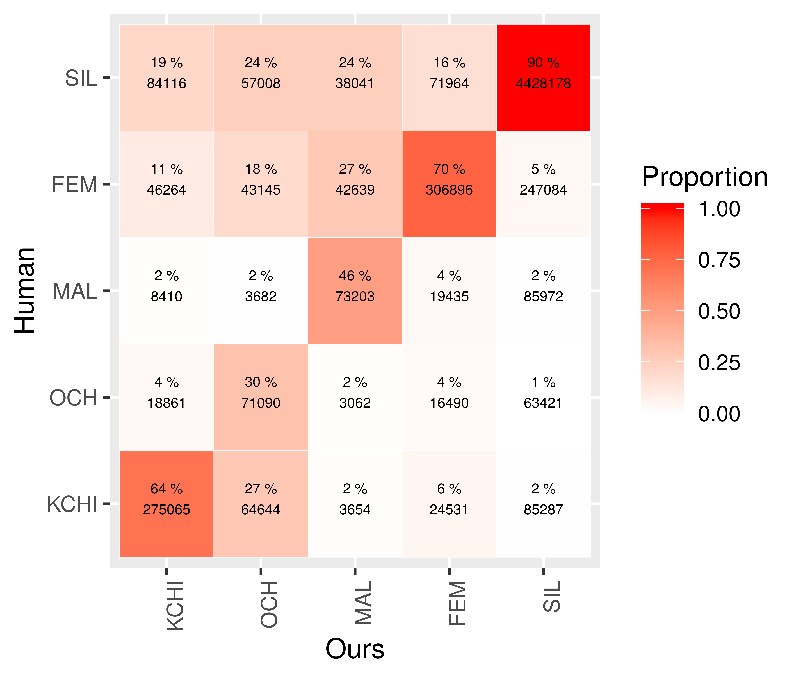 | 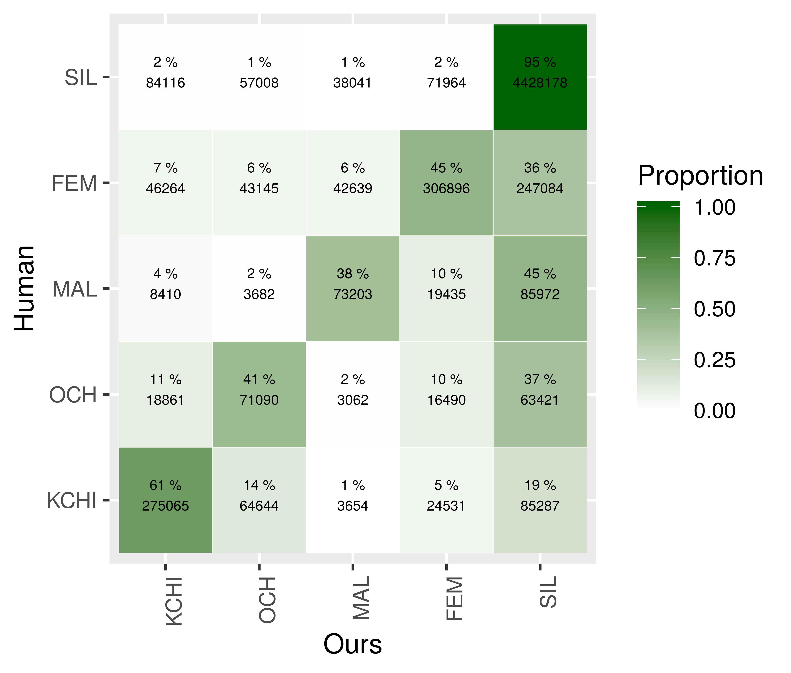

### Confusion matrices for our model

#### Speech / Non Speech

Choices : 
- **SPEECH** built from the union of [**KCHI**, **OCH**, **MAL**, **FEM**] for gold labels
- **SPEECH** considered "as-is" for our model

 Precision of our model            |  Recall of our model
:-------------------------:|:-------------------------:
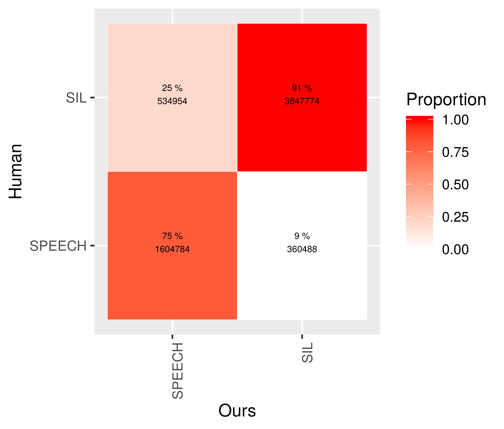 | 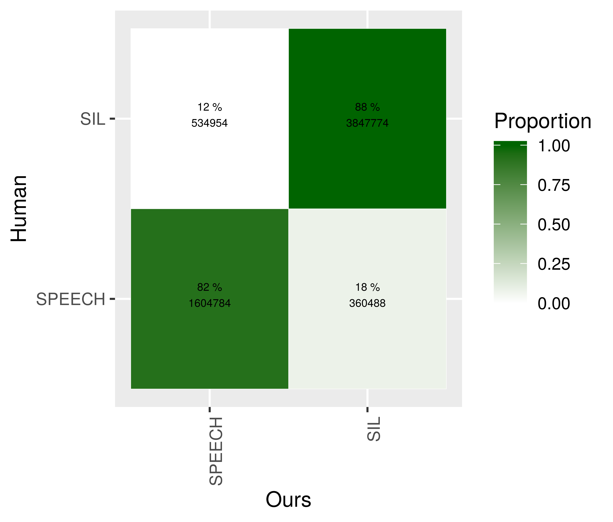

### Voice types with UNK class

Choices :
- **KCHI**, **OCH**, **MAL**, **FEM** considered "as-is" for our model and the human reference
- **UNK**, for unknown, correspond to frames that have been classified as belonging only to the **SPEECH** class (and not one of the voice type) by our model.

 Precision of our model            |  Recall of our model
:-------------------------:|:-------------------------:
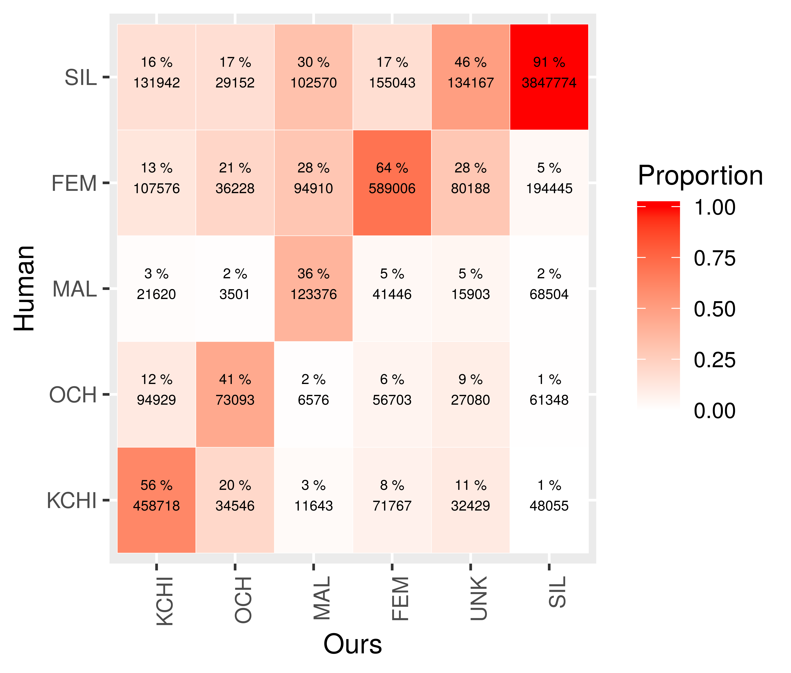 | 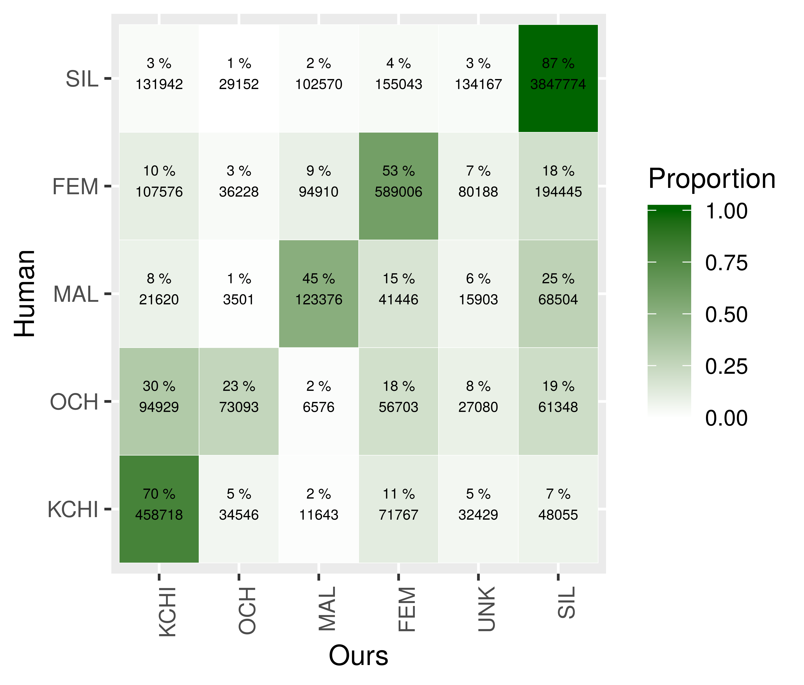

### Voice types depending on whether they're accompanied of SPEECH class or not

Choices:
- **KCHI_nsp** classes correspond to frames that have been classified as belonging to **KCHI** but not belonging to **SPEECH** (same for the other classes).
- **KCHI_sp** classes correspond to frames that have been classified as belonging to both **KCHI** and **SPEECH** by our model (same for the other classes).
- **UNK**, for unknown, correspond to frames that have been classified as belonging only to the **SPEECH** class (and not one of the voice type) by our model.

Precision of our model|
:-------------------------:|
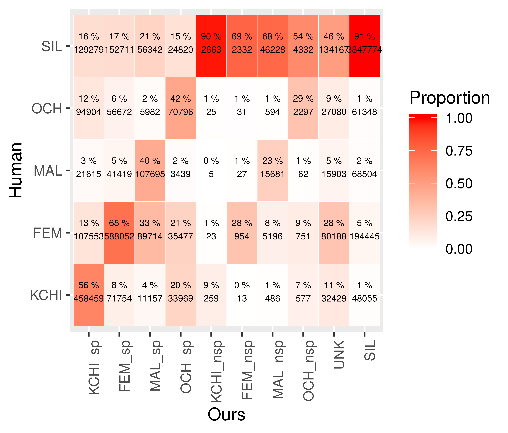 |

 Recall of our model|
 :-------------------------:|
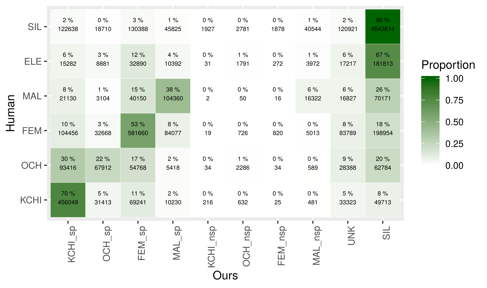 |

### References

For a complete overview of LENA performances :

1. Cristia, Alejandrina & Lavechin, Marvin & Scaff, Camila & Soderstrom, Melanie & Rowland, Caroline & Räsänen, Okko & Bunce, John & Bergelson, Elika. (2019). A thorough evaluation of the Language Environment Analysis (LENATM) system. 10.31219/osf.io/mxr8s. 